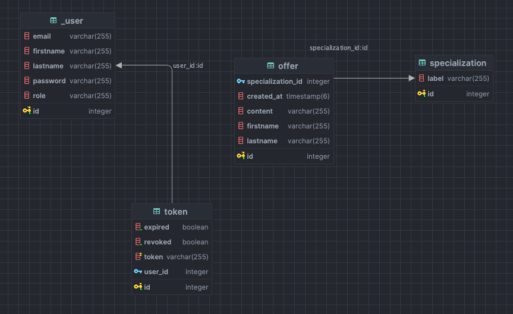

# PROJEKT REKRUTACYJNY

## SERWIS Z OFERTAMI

### Uruchomienie projektu

aby uruchomić projekt należy zainstalować node_modules i zbuildować frontend:
`yarn`
`yarn build` -> build ustawiony jest do folderu static w resource w backendzie

uruchomienie storybooka
`yarn storybook`

uruchomienie bazy danych
`docker-compose up` (flaga `-d` aby uruchomić w tle)

do uruchomienia backendu należy uzupełnić plik zmienne środowiskowe tak jak podano w przykładzie w kodzie (.example.env)

dev url aplikacji
`http://localhost:8081`
swagger dostępny pod linkiem
`http://localhost:8081/swagger-ui/index.html`
konsola bazydanych
`login: postgres`
`hasło: example`
`http://localhost:8080`

skrypt danych startowych (do przekopiowania do konsoli) dostępny w pliku init.sql

### Założenia projektu

#### technologie na które się zdecydowałem

_FRONTEND_

- **Vue 3** + **typescript**
- **Storybook**
- **Tailwindcss**
- **Vite**

_BACKEND_

- **JAVA 21**
- **Gradle**
- **SpringBoot**
- **SpringSecurity** + **JWT**
- **Swagger**
- **PostgreSQL** odpalany w dockerze
- **JUnit**

_DODATKOWE_

- Autoryzacja użytkowników przy użyciu **accesTokenu** i **refreshTokenu** JWT
- Frontent serwowany statycznie przez springa

#### Czas na wykonanie projektu: ~tydzień

### Jak poszło? - wnioski

Dobrałem za dużo wymagań do skończenia w tydzień :)
Backend jest zabezpieczony przy użyciu autoryzacji działającej na tokenach. Zastanawiałem się nad podejściem i zdecydowałem się na trzymanie accessTokenów w bazie danych i mechanizm revoke'owania ich. Mimo, że z założenia JWT jest stateless i nie musimy wykonywać zapytania do bazy danych to trzymanie "revoked accessTokenów" rozwiązuje sposób nieodwołalności tokenów i daje nam możliwość wyłączenia dostępu dla tokenu który np wyciekł.
Dodatkowa warstwa kontroli i zabezpieczenia.

Na backendzie zaimplementowany jest system refreshowania tokenów które wygasły na podstawie refreshTokenu. Wszystkie tokeny dostarczane są na frontend jako httpOnly Cookie co zabezpiecza je przed atakami XSS (na które wrażliwe są local i session storage, bo mamy do nich dostęp z poziomu javascriptu).

Storybook nie obsługuje ikon z font-awesome-icons, albo ja nie potrafię tego skonfigurować. W każdym razie nie znalazłem rozwiązania.

baza danych nie jest duża, a jej diagram przedstawia się następująco

